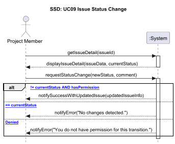

## Operation Contract

- getIssueDetail(issueId) : 사용자가 특정 이슈의 상세 정보를 시스템이 요청한다.
- displayIssueDetail(issueData, currentStatus) : 시스템이 해당 이슈의 현재 상태(currentStatus)와 기존 데이터들을 화면에 보여준다.
- requestStatusChange(newStatus, comment) : 사용자가 바꾸고 싶은 상태와 코멘트를 입력하여 변경을 요청한다.
- updateStatusAndCreateComment() : 시스템이 스스로의 상태를 갱신하는 내부 로직을 실행한다.
- ALT
  1. Case 1(성공) :  성공 메시지(notifySuccessWithUpdatedIssue)를 보낸다.
  2. Case 2 (중복) : 현재 상태와 똑같은 상태로 변경하려고 할 때, “변화 없음”에러(notifyError)를 보낸다.
  3. Case 3 (거부) : 해당 상태로 바꿀 권한이 없는 계정일 경우, 권한 거부 메시지(notifyError)를 보낸다.

## Operation Contract

[Operation Contract : getIssueDetail]

- Operation : getIssueDetail(issueId : int)
- Cross References : Use Case UC09 (이슈 상태 변경), UC05 (이슈 상세 정보 확인)
- Pre-conditions:
  1. 사용자가 시스템에 로그인되어 있어야 한다.(currentUser 존재)
  2. 입력받은 issueId 에 해당하는 이슈가 시스템(JSON)에 존재해야 한다.
- Post-conditions:
  - [Case 1: Success] 현재 유저의 Role이 변경 권한을 가지고 있고, newStatus가 현재 상태와 다를 경우 :
    - Issue 객체의 Status가 newStatus 로 변경됨.
    - 입력받은 comment를 내용으로 하는 새로운 Comment 객체가 생성되어 해당 이슈의 comments 리스트에 추가됨.
    - 변경된 상태가 Fixed일 경우, fixerId 필드가 현재 유저 ID로 업데이트되었다.
    - 시스템이 업데이트된 전체 이슈 정보를 updatedIssueInfo 에 담아 반환함.
  - [Case 2: Duplicate Status] newStatus 가 현재 이슈의 상태와 동일할 경우 :
    - 시스템 내부의 어떠한 상태 변경도 일어나지 않음.
    - 시스템이 “No changes detected.” 에러 메시지를 반환함.
  - [Case 3: Permission Denied] 현재 유저의 Role이 해당 상태 변경 권한을 가지고 있지 않을 경우 :
    - 시스템 내부의 어떠한 상태 변경도 일어나지 않음.
    - 시스템이 “You do not have permission for this transition.” 에러 메시지를 반환함.

[Operation Contract : requestStatusChange]

- Operation : requestStatusChange(newStatus, comment)
- Pre-conditions:
  1. 시스템에 유효한 세션(로그인)이 존재해야 한다.
  2. 수정 대상인 issueId가 유효해야 한다.
- Post-conditions (Success Case):
  1. Issue 객체의 Status가 newStatus로 변경된다.
  2. 입력받은 comment를 내용으로 하는 새로운 Comment 객체가 생성되어 해당 이슈의 comments 리스트에 추가된다.
  3. 상태가 Fixed일 경우, fixerId 필드가 현재 유저 ID로 업데이트된다.
  4. 시스템은 업데이트된 전체 이슈 정보를 updatedIssueInfo 에 담아 반환한다.
